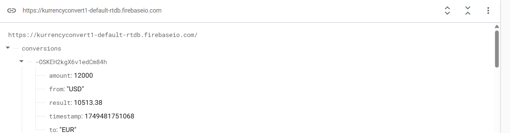
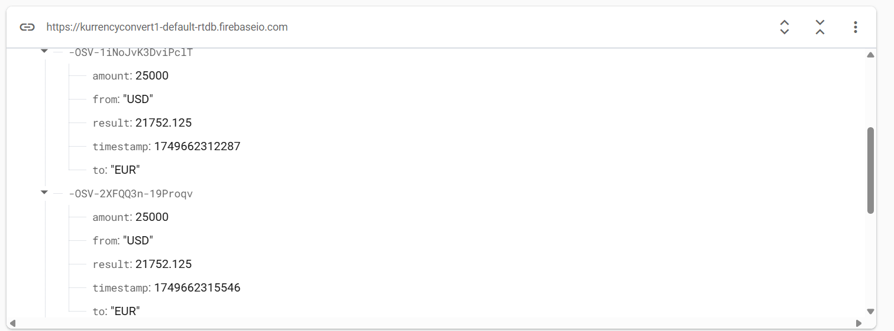
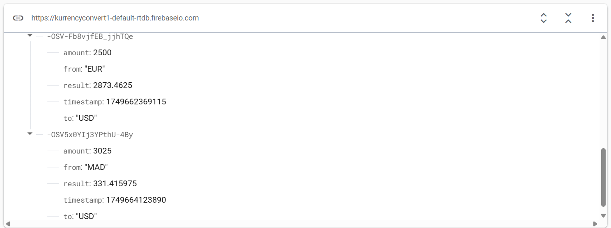

# 💱 KurrencyConvert - Application Android de Conversion de Devises

## 🎯 Objectif du projet

Ce projet a été réalisé dans le cadre d’un TP de développement mobile à l’École Suptechnology. Il a pour objectif de :
- Maîtriser le développement Android avec le langage **Kotlin**.
- Manipuler les composants d’interface utilisateur Android (EditText, Spinner, Button, TextView).
- Effectuer des appels à une **API REST** avec **Retrofit** et les **coroutines Kotlin**.
- Sauvegarder des données dans **Firebase Realtime Database**.

---

## 🧰 Technologies utilisées

- **Kotlin** pour le développement Android.
- **Android Studio** pour l’environnement de développement.
- **Retrofit** pour l’appel d’API.
- **Kotlin Coroutine** pour la gestion des appels asynchrones.
- **Firebase Realtime Database** pour le stockage des conversions.

---

## 🚀 Instructions pour exécuter l'application

1. **Cloner le projet** ou importer le dossier dans Android Studio.
2. S’assurer d’avoir un environnement Android configuré avec :
    - SDK Android installé (voir `local.properties`)
    - Connexion internet active
3. Connecter le projet à un projet **Firebase** :
    - Activer **Realtime Database** dans Firebase Console.
    - Copier le fichier `google-services.json` dans le dossier `app/` (non fourni ici).
4. Lancer l’application sur un **émulateur** ou un **appareil Android physique**.
5. Sélectionner les devises, entrer un montant, et cliquer sur **Convertir** pour effectuer une conversion.
6. Chaque conversion sera automatiquement enregistrée dans Firebase.

---

## 🔍 Fonctionnalités

- Saisie du montant via un champ **EditText**.
- Sélection des devises source et cible via des **Spinner**.
- Conversion via un appel à l'API :
- Affichage du résultat dans un **TextView**.
- Enregistrement de chaque opération avec :
- `timestamp`
- `source`
- `target`
- `amount`
- `result`

---

## 🖼️ Capture d'écran Firebase Realtime Database

> 
> 
> 

---

## ✅ Contraintes respectées

- Saisie valide et contrôlée (montant positif, devises sélectionnées).
- Structure MVVM recommandée.
- Appel API asynchrone.
- Code commenté et structuré.
- Interface claire et réactive.

---

